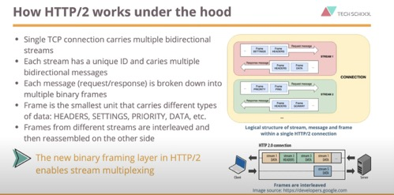
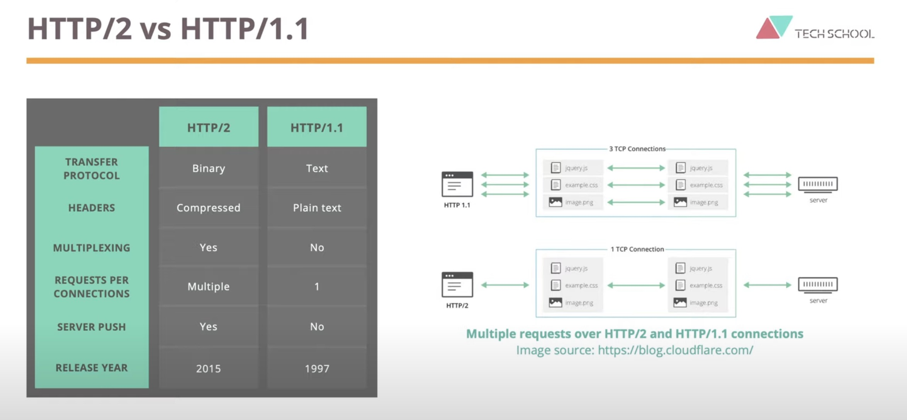
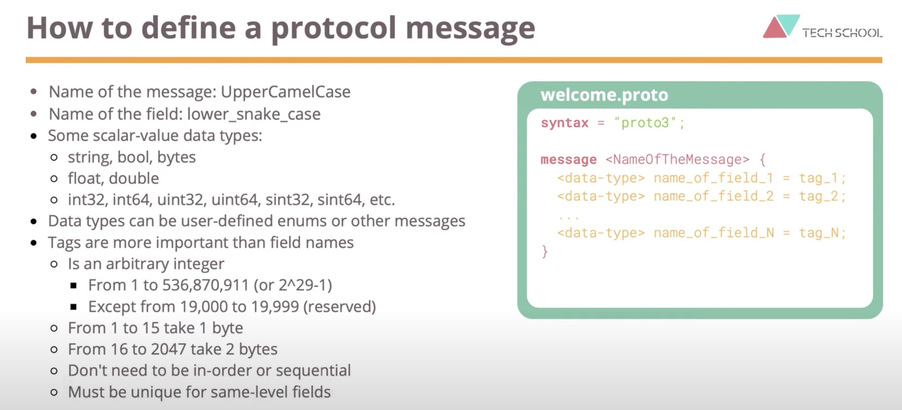

# gRPC 系统复盘

**参考列表** <br>
[视频](https://www.youtube.com/watch?v=2Sm_O75I7H0&list=PLy_6D98if3UJd5hxWNfAqKMr15HZqFnqf) <br>
[文档](https://dev.to/techschoolguru/introduction-to-grpc-why-what-how-4194) <br>
[prorobuf](https://developers.google.com/protocol-buffers/docs/gotutorial) <br>
[gRPC](https://grpc.io/) <br>
《gRPC与云原生应用开发：以Go和Java为例》一书。


### 什么是RPC？

1. RPC (Remote Procedure Call) 远程调用，简单理解就是一个服务节点请求另一个服务节点提供的服务;

1. 函数调用就是最常见的本地调用，RPC则是远程调用。

1. 将本地过程调用变成远程调用会面临各种问题。
    1. 网络传输
    1. 数据传输协议
    1. 如何确定调用哪一个函数
    1. ......

### gRPC 

1. 什么是gRPC? gRPC 解决了什么问题？

    gRPC是一个高性能、开源、通用的RPC框架，常用于分布式系统，并提供了主流语言的版本。

1. gRPC 是如何工作的，或者说gRPC是如何实现远程调用的？

    首先每个服务节点通过gRPC框架生成相同的方法和功能的存根，存根在底层调用gRPC框架通过网络传输与其他服务器交换信息。


1. 那么gRPC是如何生成代码的呢？并且gRPC生成的代码在不同的语言之间也可以调用。

    为了生成服务器的存根，首先要编写API的定义（或者说服务接口），gRPC使用 Protocol Buffer 来定义服务接口。那么 protocol buffer 又是什么呢？ 它是序列化结构化数据的语言，可以理解为和JSON、XML等产物。定义好接口服务，就需要使用gRPC插件编译出对应语言的代码。（当然也有其他的序列化协议，并一定要使用ta）

1. gRPC 为什么要使用Protocol Buffer来定义API服务接口呢？
    
    - 它非常容易阅读和理解
    - 与多种语言自动生成代码进行相互操作
    - 它以二进制格式表示数据，与基于文本格式（如：JSON或XML）相比体积更小，序列化效率更高，传输更快。
    - 它是一个强类型的API契约，因此是类型安全的。
    - 可以向前/后兼容
    - 支持多种编程语言编译成代码

### gRPC 为什么使用 HTTP/2 作为传输协议？

1. 与基于文本的协议相比（如HTTP/1.1），HTTP/2使用的是二进制传输

1. 二进制传输，体积更小，解密更安全，因而Protocol Buffer也是二进制的


1. HTTP/2 使用 HPACK（HTTP/2 Header Compression for HTTP）是一种用于HTTP/2协议中头部压缩的方法;旨在提高性能并减少网络延迟。（可以简单理解，预先定义了一些标头）

1. HTTP/2 中可以进行多路复用，这意味着客户端和服务端在单个请求和响应中并行发送多个请求和响应。这有助于减少延迟，并提高网络利用率。

1. 客户端的一个请求服务端可以发送多个响应。

### HTTP/2 有上面这么多优点，是如何工作的？

首先一个TCP连接承载着多个双向流，每个流都有唯一的标识，并承载多个双向消息。
每个消息，可以请求或者响应，被分解为多个二进制帧。帧时承载不同类型数据的最小单位。如：HEADERS、SETTINGS、PRIOITY、DATA，etc。
事实上流并不是单独流动的，而是他们的帧在连接上交错，并且在连接时会重新组装到达另一边，流是可以复用的

逻辑结构图如下：



``HTTP/2 vs HTTP/1.1``

1. HTTP/2 是二进制协议，而HTTP/1.1是纯文本
1. 标头在HTTP/2中是被压缩的，而HTTP/1.1是纯文本
1. HTTP/2允许多路复用，而HTTP/1.1则不允许
1. HTTP/2可以在单个请求链中发送多个请求和响应，而HTTP/1.1在一个链接中则仅能发送单个请求和响应，这个意味着HTTP/1.1必须创建多个单独的TCP链接来发送多个请求。
1. HTTP/2可以使用服务推送，而HTTP/1.1不能
1. HTTP/2在2015年发布，HTTP/1.1是1997年发布



### gRPC 比 REST 更好吗？在哪里使用它？

- gRPC 有4种类型。
    1. Unary 一元流：客户端发起一个请求，服务端回复一个响应。（类似 web api）
    1. Client Streaming： 客户端流
    在这种模式下，客户端将发送多个消息流，服务端只发回单个响应。
    1. Server Streaming：服务端流，和客户端流刚好相反，客户端发送一个请求，服务端回应多条消息流
    1. Bidirectional Streaming: 双向流
    这是复杂的，客户端和服务端以任意顺序并行发送和接受多个消息，非常灵活并不会阻塞
- gRPC 对比 REST 区别。
1. gRPC 使用 HTTP/2传输协议，比HTTP/1.1快得多。
1. gRPC 使用 Protobuf协议 来序列化，比XML、JSON等基于文本格式压缩更小
1. gRPC 的API定义是严格的，需要在 protobuf 文件中定义，在REST中是松散的或可选的，不需要强制定义
1. 在gRPC中内置代码生成REST中，必须使用第三方工具，如OpenAPI和Swagger
1. 他们两者都支持 TLS/SSL 保护。
1. REST浏览器支持，gRPC浏览器支持有限，需要使用grpc-web proxy。
1. 什么时候适用适用gRPC。
- Microservices 微服务，因为它支持低延迟，高吞吐量通信
- Strong API contract 严格遵守API的定义。
- gRPC也适用于多语言环境。
- 点对点通信也是使用gRPC的好地方，具有双向流通信。
- gRPC 是网络受限环境的绝佳选择，例如移动应用程序，因为它的消息体小。轻量级。

### 使用 VsCode 定义 protobuf message

需要安装两个插件： Clang-Format、vscode-proto3

安装 protobuf 编译器，此处是以Debian系列为例
```bash
apt install -y protobuf-compiler

protoc --version

```

- 插件安装 (一个 proto生成普通grpc message数据定义，一个生成grpc rpc 代码)
```bash
    $ go install google.golang.org/protobuf/cmd/protoc-gen-go@latest
    $ go install google.golang.org/grpc/cmd/protoc-gen-go-grpc@latest
```
- 导出命令：`export PATH="$PATH:$(go env GOPATH)/bin"` （最好还是在 .bashrc 中设置,张贴放到最后就行）

上面的配置内容 [参考](https://grpc.io/docs/languages/go/quickstart/)

``还有另一种配置的方法，相对简单一些，不容安装（go install）上面两个插件。``
```bash
# 安装编译器
$ apt install -y protobuf-compiler

# 在项目使用 go get 上面两个插件即可
$ go get -u google.golang.org/grpc
$ go get -u google.golang.org/grpc/cmd/protoc-gen-go-grpc
```


---

``如何定义 protobuf？``



- 书写规则
    1. 消息名称应该遵循大驼峰（UpperCamelCase）
    1. 消息的字段应该小写蛇形（lower_snake_case）
    1. 每个消息字段都应该分配一个唯一的标签（标签比字段名称更重要，因为protobuf将使用它来序列化）
    1. 标签最小值为 1，最大值是(2^29-1),并且除了19000到19999的数字（内部协议缓冲实现保留标签）
    1. 1～15的标签占1个字节编码，16～2047占用两个字节，因此建议定义时从1开始
- Protocol Buffers 内置数据类型
    - string，bool，bytes
    - float，double
    - int32，int64，uint32，uint64，sint32，sint64 ...
    - 自定义类型，例如枚举或其他消息

- 尽量给每一个字段写注释